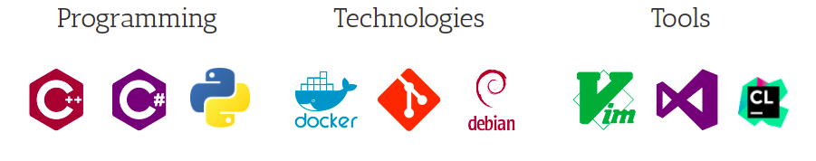

 

## Introduction

Software Engineer, passionate about designing and building innovative technologies using modern object-oriented languages
such as C++, C#, or Java. Excellent written and verbal communication skills, team player, interested in volunteer
activities, and fond of outdoor games.

Currently, I am part of Afiniti Switch Interface Team to pair sales or service agents with customers in both voice and digital channels by identifying valuable patterns of human interaction. The improved customer experience created through this one-to-one
paring is measurable and directly increases the revenue for clients including British Telecom, Concentrix, United Health
Group, Caesars, and Sky.

## Experience 

**Software Engineer (April 2021 - Present)** 
*Afiniti* 

* Part of Afiniti Switch Interface Team to pair sales or service agents with customers in both voice and digital channels by identifying valuable patterns of human interaction. The improved customer experience created through this one-to-one paring is measurable and directly increases the revenue for clients including British Telecom, Concentrix, United Health Group, Caesars, and Sky.
* Developed mapping and routing solution which successfully routes 10k call load (3 calls per second). Actively utilizes C++ REST SDK, HTTP request handling and C++ multi-threading.
* Develop TCP-based multi-threaded server application in C++ which process 10k client requests.
* Develop C++ service to interface with REST API and publish Switch Interface Schema to configuration servers.
* Create and improve REST client in C++ for a Switch Interface (Genesys PureConnect) that accesses Genesys data resources, manages connections with the IC server, specifies authentication and station settings, watches for connection state-change events, and performs actions relative to the connected session user.
* Analyze and test Genesys Interaction Center Web Services (ICWS) RESTful API’s for Afiniti integration with switch interface.
* Working closely with solution integration, deployment, DevOps and QA teams for the design and development of solutions to meet client requirements for the functionality and performance.

**Softawre Engineer/Consultant (March 2020 - April 2021)** 
*Zortik Technologies* 

* Analyze and Develop Network Intelligence and Security Engine (NISE) validation modules in C++ and Linux.
* Performed unit testing with GTest framework, memory profiling with Valgrind, and generated flame graphs for CPU utilization with open-source Linux tools.
* Analyze and develop machine learning model in C++ for measuring video quality of experience, achieved 93.5% and 91.8% predicted score for encrypted and unencrypted video respectively.

**Research Assistant/Associate (February 2020 - April 2021)** 
*National Center for Robotics and Automation (NCRA)* 
* Develop and analyze software-in-the-loop simulations for unmanned aerial & ground vehicles in C++ and Linux.
* Arslan Ali, M. Muzamil, Ans H. Qureshi, M. Mansoor Shukar,and Haroon Yousaf ”A Decentralized Formation Control Approch for Swarm of UAV” IEEE ICRAI 2021, Islamabad, Pakistan. (Best Session Paper Award)

**Software Development Consultant  (February 2020 - March 2021)** 
*Upwork* 
* Develop CPU calculate module in C++ and generate build for x86 and ARM-based architecture using CMake.
* Develop C++ based solution for simultaneous localization and mapping (SLAM).

**Embedded System Engineer (Agust 2019 - February 2020)** 
*NexTek Service* 
* Develop windows desktop application in C++ using Microsoft Foundation Classes (MFC) and implemented C++ SDK for digital media recording applications.

**Graduate Research Assistant (March 2016 - September 2017)** 
*Bio Robotics Lab, Korea University of Technology and Education* 

* ”Novel Learning from Demonstration Approach For Repetitive Teleoperation Tasks”: Funded by the German Research Foundation (DFG) and the Industrial Strategic Technology Development Program (10069072) MOTIE, South Korea.
Done in Collaboration with Human Assistive Robotics Group at TUM, Germany, published in 2017 IEEE World Haptics Conference Munich, Germany, and ranked top 10%.

* Affan Pervez, Arslan Ali, Jee-Hwan Ryu and Dongheui Lee ”Novel Learning From Demonstration Approach For Repetitive Teleoperation Tasks” IEEE World Haptics Conference 2017, Munich Germany (Ranked top 10%)

* ”Soft continuum growing robot simulation in a virtual environment:” Done in collaboration with CHARM Lab Standford University, USA, and supported by the US Department of Defence and Republic of Korea’s Ministry of Trade, Industry, and Energy (MOTIE).